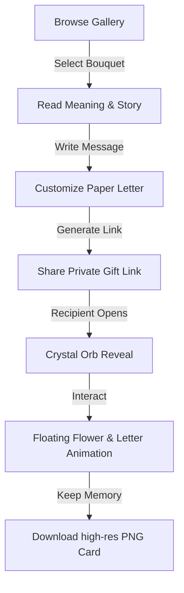

# 🌸 Pixel Bouquet (باقة بكسل)

**Pixel Bouquet** is a premium, interactive digital experience designed to help people express appreciation, friendship, and love through virtual pixel-art flowers and custom handwritten letters. 

By combining retro pixel aesthetics with elegant, modern glassmorphic web design, the project provides a unique digital keepsake that recipients can keep forever.

---

## 🎨 The Concept

In a world of fleeting instant messages, **Pixel Bouquet** reintroduces intention and romance into digital communications. The project serves as a digital florist where senders can pair high-fidelity animated pixel-art bouquets with personalized letters. 

Every flower in the collection has been carefully chosen for its symbolic meaning (لغة الزهور) and historical backstory, helping users choose a bouquet that truly matches their feelings.

---

## 🗺️ The User Journey

### 1. Choosing a Bouquet
Senders explore a curated gallery of pixel-art flower arrangements. Hovering over each bouquet reveals its name and symbolic meaning to help choose the perfect emotional match.

### 2. Drafting the Letter
Selecting a bouquet opens a paper-textured writing canvas. The sender inputs:
*   **The Recipient** (إلى)
*   **A Personal Message** (written on lined digital paper)
*   **The Sender** (بكل حب)

### 3. Sharing the Magic
With one click, a secure, private link is generated. Senders can copy this link and share it through WhatsApp, iMessage, email, or social media.

### 4. The Crystal Orb Reveal
When the recipient opens the link, they are presented with a floating, semi-translucent crystal glass orb containing a preview of the flower. Tapping **"افتح الهدية" (Open the Gift)** triggers a magical reveal:
*   A custom AnimeJS entrance animation brings the flower to life.
*   The pixel bouquet begins floating in mid-air.
*   Cascading petals fall gently down the screen.
*   The personal letter folds open in an elegant paper card design.

### 5. Keeping the Memory
To ensure the gift lasts forever, recipients can click **"حفظ كصورة" (Save as Image)** to download their custom letter and animated bouquet as a high-resolution PNG card.

---

## 💐 The Flower Gallery (دليل باقات الورد)

The application features a curated library of bouquets, each configured with unique floating physics:

| Bouquet Name | Arabic Name / Description | Emotional Meaning (معنى الوردة) | Historical Story (الحكاية) |
| :--- | :--- | :--- | :--- |
| **Quiet Love** | ورد بينك هادي ومريح للعين | البدايات الحلوة، الحب الهادئ، والإعجاب الصادق. | مزيج الورد الوردي للرقة وجيبسوفيلا (نفس الطفل) للبراءة كرسالة شكر وتقدير. |
| **Pink Elegance** | ورد بينك وزنابق الليليوم | النقاء، الاحترام العميق، والجمال الذي يخطف العين. | زنبق الليليوم كرمز تاريخي للجمال الفائق لتقول "أنت شخص نادر وغالي". |
| **Crimson Fantasy** | باقة فخمة من الورد الأحمر | الرومانسية المطلقة، العاطفة القوية، والحب الثابت. | الورد الأحمر الغامق الكلاسيكي للتعبير المباشر عن صدق المشاعر وعمقها. |
| **Sunlit Chrysanthemum** | أزهار الأقحوان المبهجة | التفاؤل، البهجة، السند الحقيقي، والفخر. | زهرة الكريسنتيموم الدافئة التي ترمز للشمس لتتمنى للآخرين طاقة إيجابية. |
| **Ombre Mixed Roses** | ميكس ألوان متدرج | التناغم، الانسجام، والتوازن في العلاقات المميزة. | دمج وتدرج الألوان فن قديم للتعبير عن المشاعر المركبة والغنية. |
| **Carnation Harmony** | القرنفل الوردي مع الورد | الافتتان الشديد، التميز، والافتخار بوجود شخص. | القرنفل كان يسمى "زهرة الآلهة" لدى الإغريق تعبيراً عن التميز والتقدير. |
| **Classic Carnations** | باقة كلاسيكية من القرنفل | الحب الصافي، الاهتمام الدائم، والوفاء المستمر. | زهور قوية الاحتمال تمثل الصمود والوقوف بجانب من تحب دائمًا. |

---

## 💫 Interactive Details & Design

*   **Bespoke Animation Profiles:** Senders don't just send static pixels. Each bouquet has specific gravity and animation configurations. For example, *Crimson Fantasy* beats with a heart-like pulse, while *Quiet Love* floats in a gentle, slow wave.
*   **Privacy-First Sharing:** Gift pages represent private communications. The project automatically excludes these URLs from public search engine indexes (`robots: noindex`), ensuring letters remain shared only between the sender and the recipient.
*   **Bilingual Content:** The interface and the stories are fully tailored to Arabic emotional expressions (using Egyptian Arabic phrasing) while supporting clean English design.

---

## ✉️ Contact

For inquiries or feedback, feel free to reach out at [mahmoudfalous@gmail.com](mailto:mahmoudfalous@gmail.com).

